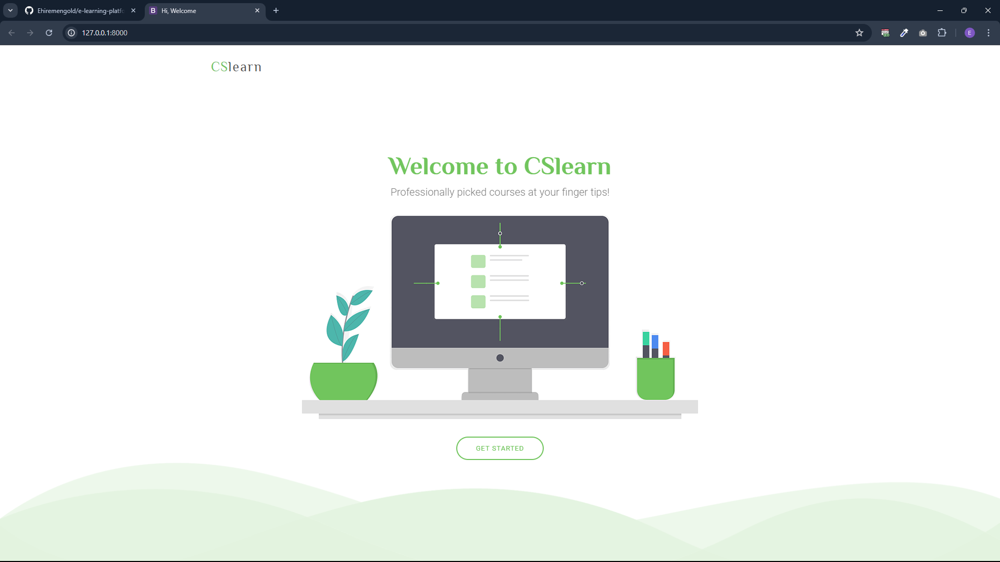
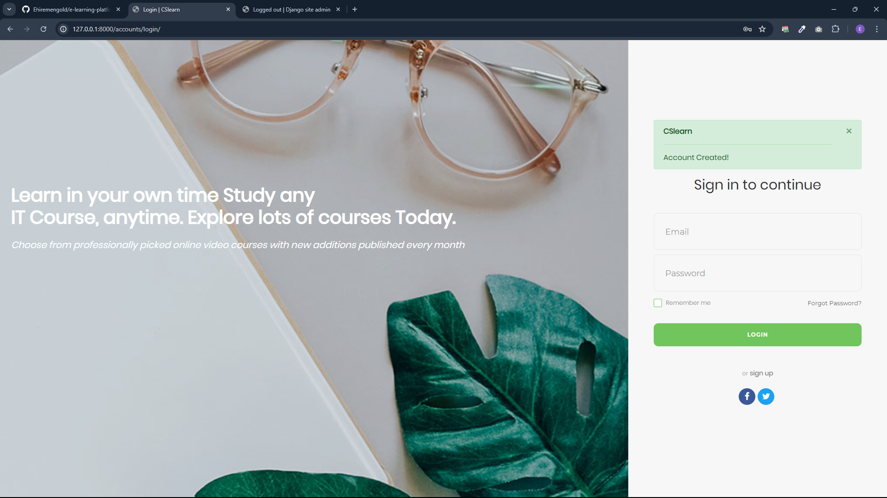
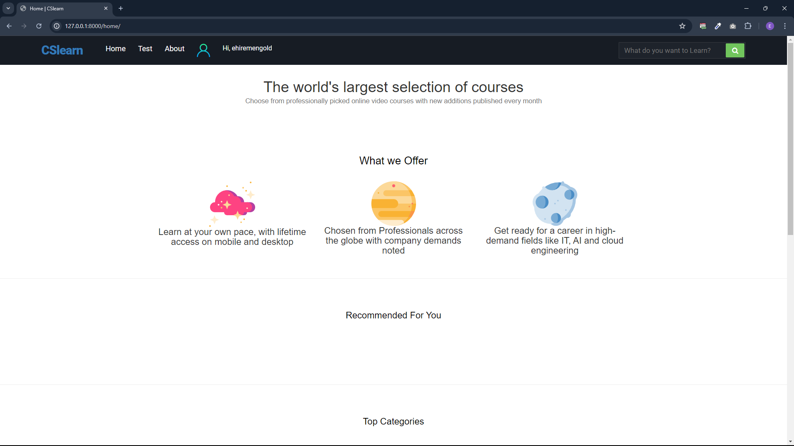

# Personalized Online Learning Platform with Django

Welcome to this learning platform repository, built using Django. This platform utilizes questionnaires answered during account creation to recommend courses tailored to users. Users can take tests after completing courses and receive real-time results.

## Overview

This project aims to provide an interactive learning experience where users can:

- **Create Accounts**: Answer questionnaires to receive personalized course recommendations.
- **Take Courses**: Enroll in recommended courses and learn interactively.
- **Take Tests**: After completing courses, take tests to assess their knowledge with real-time results.
- **Manage Profile**: View course progress, test results, and update personal information.

 

